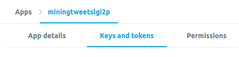
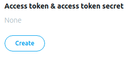
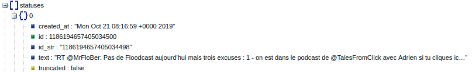

# Préambule

* PHP doit être installé sur votre machine ([Grafikart](https://www.youtube.com/watch?v=OVTnj3hcHuc)).
* L'installation ci-dessus vous permet d'exécuter la commande suivante au sein de l'invite de commandes Windows.

```
php -S localhost:80
```

* L'extension cURL doit être renseignée dans le fichier php.ini ([aide 1](https://www.julp.fr/articles/15-php-l-extension-curl.html), [aide 2](https://www.codeooze.com/coding/php-curl-on-windows/)).


Par exemple:

```
extension=D:\PHP\ext\php_curl.dll
```

* Si vous rencontrez un problème de certificat SSL vous pouvez vous diriger vers ce [lien](https://thisinterestsme.com/php-curl-ssl-certificate-error/).


# API Twitter

Ce dépôt a pour objectif de vous guider dans la mise en place et l'utilisation de l'[API standard](https://developer.twitter.com/en/docs/basics/getting-started) de Twitter. Cette API permet notamment de poster et récupérer des tweets, de suivre, rechercher et obtenir des informations sur des utilisateurs ou bien de récupérer les tendances actuelles.

## Création d'une *Apps*

La création d'une *Apps* est obligatoire pour obtenir un ensemble de clés d'accès permettant de réaliser des requêtes sur les API de Twitter. Les instructions suivantes présentent le protocole pour créer une *Apps*.

* Créer un compte développeur [Twitter](https://developer.twitter.com/). Vous devez renseigner un ensemble de champs pour justifier l'utilisation de l'API.
* Créer une [*App*](https://developer.twitter.com/en/apps). Renseignez uniquement les champs requis (pour le champs Website URL vous pouvez par exemple renseigner l'adresse de votre compte Twitter).


* Lorsque votre *App* est créée vous avez accès à un ensemble de clés d'authentification: *API key* et  *API Secret*. Vous pouvez voir ces clés dans l'onglet **Keys and tokens** de votre *App*.



* Maintenant vous devez générer les clés d'accès suivantes: *Access token* et *Access token secret* (en *Read and Write* par défaut).



## Récupérer des tweets

Selon la nature des données que vous voulez récupérer ou le traitement que vous voulez effectuer, l'URL de l'API diffère (la liste des API est disponible à cette [adresse](https://developer.twitter.com/en/docs)).
Par exemple, pour rechercher et récupérer des tweets, nous devons adresser une requête à l'adresse suivante: **https://api.twitter.com/1.1/search/tweets.json**. Les données retournées par les API à la suite des requêtes sont au format JSON. C'est un format de données simple et efficace qui permet de stocker des données de manière structurée (*cf* la section suivante).

Le fichier *index.php* vous permet de récupérer les Tweets et les Réponses associés à un nom de compte donné. Pour cela, vous devez télécharger les fichiers *index.php* et *TwitterAPIExchange.php*, compléter les champs suivants avec les données de connexion de votre *App*:

```
$settings = array(
    "oauth_access_token" => "YOUR_OAUTH_ACCESS_TOKEN",
    "oauth_access_token_secret" => "YOUR_OAUTH_ACCESS_TOKEN_SECRET",
    "consumer_key" => "YOUR_CONSUMER_KEY",
    "consumer_secret" => "YOUR_CONSUMER_SECRET"
);
```

et enfin, renseigner un nom de compte Twitter (*e.g.* MonsieurDream) pour voir apparaître la description de ses derniers Tweets et Réponses.

```
$json = getTweets($settings, "MonsieurDream");
```

La fonction *getTweets()* exploite l'utilitaire cURL du module *php-curl*.
Vérifier la viabilité de votre environnement en accédent à la page *index.php* sur votre navigateur (vous devez activer votre serveur local PHP au préalable).

Si vous obtenez la liste des Tweets, votre environnement est apte à effectuer des requêtes vers l'API Twitter. Sinon, vous devez installer et configurer l'utilitaire cURL ([ressource 1](https://www.informatiweb.net/tutoriels/programmation/2-php/32--activer-l-extension-curl-de-php-sous-windows.html) ou [ressource 2](http://www.tomjepson.co.uk/enabling-curl-in-php-php-ini-wamp-xamp-ubuntu/)).

## Comprendre les données renvoyées par l'API Twitter

L'API Twitter renvoie des données au format JSON. Commenter les lignes 17, 19, 20, 21 et 22 du fichier *index.php* avec un double slash ( *//* ). Recharger ensuite votre page. Vous devez obtenir un ensemble de données compactes. Afin de visualiser ces données, copier/coller ces données et rendez-vous au lien suivant: http://jsonviewer.stack.hu/ . Dans l'onglet *Text* coller vos données et appuyer sur *Format*. Vos données s'affichent désormais de manière indentée. Appuyer sur l'onglet *Viewer*. Ce dernier permet de visualiser la structure hiérarchique de vos données.



Sur la figure ci-dessus, vous pouvez visualiser les symboles "[]" et "{}" respectivement à côté de *statuses* et de *0*. Les crochets indiquent une liste (un *array*), soit un tableau de valeurs dont les indices sont des nombres (de 0 à n). Les accolades indiquent un dictionnaire soit une liste de clés/valeurs dans laquelle une valeur est indexée par une clé (chaîne de caractères).

Par exemple, si vous voulez accéder à l'attribut *text* vous pouvez écrire:

```
$json["statuses"][0]["text"];
```

où *$json* est une variable qui stocke le retour de l'API Twitter.

## Comprendre la classe *TwitterAPIExchange.php*

L'envoi d'une requête s'effectue avec l'utilitaire cURL (permet d'effectuer des requête HTTP, HTTPS, FTP, etc.). Les requêtes adressées aux API doivent respecter un format particulier détaillé à cette [adresse](https://developer.twitter.com/en/docs/tweets/search/api-reference/get-search-tweets).


```
$ curl --request GET
 --url 'https://api.twitter.com/1.1/search/tweets.json?q=from%3Atwitterdev&result_type=mixed&count=2'
 --header 'authorization: OAuth oauth_consumer_key="consumer-key-for-app",
 oauth_nonce="generated-nonce", oauth_signature="generated-signature",
 oauth_signature_method="HMAC-SHA1", oauth_timestamp="generated-timestamp",
 oauth_token="access-token-for-authed-user", oauth_version="1.0"'
```

L'objectif est de construire cette requête à partir d'un code PHP. Le code que vous allez rencontrer provient du fichier *details.php*. Selon l'environnement de développement (serveur web) que vous avez, le module *php-curl* devra être téléchargé. En effet, ce module vous permet de réaliser des commandes cURL. Par exemple, le code ci-dessous permet d'effectuer une commande cURL.

```
$feed = curl_init(); // Initialisation d'une session cURL.
curl_setopt_array($feed, $options); // Ajout des options, url et HTTP Header de la requête.
$json = curl_exec($feed); // Exécution de la requête.
curl_close($feed); // Fermeture de la session cURL.
echo $json; // Affichage du résultat de la requête.
```

La partie la plus compliquée ici est de renseigner les options (les détails à cette [adresse](https://developer.twitter.com/en/docs/basics/authentication/guides/authorizing-a-request)) de la requête et plus spécifiquement l'entête HTTP de la requête (*header*). Comme nous l'avons vu ci-dessus, l'entête doit contenir plusieurs informations:
* *oauth_consumer_key* correspond à votre *API key*.
* *oauth_nonce* correspond à un token (chaîne de caractères ou entier) unique à chacune de vos requêtes (*e.g.* le *timestamp*).
* *oauth_signature* correspond à une signature de sécurité pour permettre à Twitter de vérifier si la requête à été interceptée. Ce paramètre nécessite une procédure à part entière décrite à cette [adresse](https://developer.twitter.com/en/docs/basics/authentication/guides/creating-a-signature).
* *oauth_signature_method* est la manière d'obtenir la signature, ici la méthode HMAC-SHA1 est utilisée.
* *oauth_timestamp* correspond au *timestamp* que l'on peut obtenir sous PHP avec la fonction *time()*.
* *oauth_token* correspond à votre *Access token*.
* *oauth_version* est fixé à 1.0.

La création de la signature nécessite les étapes suivantes.

* Création de la chaîne à encrypter. La chaîne est constituée dans l'ordre: de la méthode utilisée pour la requête (ici *GET*), d'un esperluette (*&*), de l'url de base pour accéder à l'API (ici *https://api.twitter.com/1.1/search/tweets.json*), de nouveau d'un esperluette (*&*) puis dans l'**ordre alphabétique** l'ensemble des clés/valeurs: *oauth_consumer_key*, *oauth_nonce*, *oauth_signature_method*, *oauth_timestamp*, *oauth_token*, *oauth_version* et des paramètres de l'url (*e.g. count=2*) séparés par un esperluette (*&*). L'url et l'ensemble des clés/valeurs doivent être encodés avec la fonction *rawurlencode()* de PHP qui permet d'encoder (remplacement des caractères spéciaux *e.g.* & --> %26, @ --> %40) une chaîne en URL selon une norme donnée (RFC 3986). A noter que les esperluettes entre les clés/valeurs et les paramètres de l'url sont également encodés.

```
$base_info =
GET&https%3A%2F%2Fapi.twitter.com%2F1.1%2Fsearch%2Ftweets.json&count%3D2%26oauth_consumer_key%3Dxvz1evFS4wEEPTGEFPHBog%26oauth_nonce%3D1571229186%26oauth_signature_method%3DHMAC-SHA1%26oauth_timestamp%3D1571229186%26oauth_token%3D370773112-GmHxMAgYyLbNEtIKZeRNFsMKPR9EyMZeS9weJAEb%26oauth_version%3D1.0%26q%3Dfrom%253A%2540xSqueeZie
```

* Création d'une clé d'encryptage obtenue à partir de la concaténation de l'*API Secret* et de l'*Access token secret* avec un esperluette (*&*). A noter que si des caractères spéciaux apparaissent dans votre clé ou *token* il faut utiliser la fonction *rawurlencode()*.

```
$composite_key =
kAcSOqF21Fu85e7zjz7ZN2U4ZRhfV3WpwPAoE3Z7kBw&LswwdoUaIvS8ltyTt5jkRh4J50vUPVVHtR2YPi5kE
```

* Création de la signature à partir de la méthode HMAC-SHA1 qui crypte la chaîne de caractères à partir de la clé précédemment créée. Les fonctions *base64_encode()* et *hash_hmac()* de PHP sont exploitées.

```
$oauth_signature = base64_encode(hash_hmac('sha1', $base_info, $composite_key, true))
```

Lorsque vous avez généré votre signature, vous pouvez renseigner les options de la session cURL.

```
// Générer l'entête HTTP de la requête en fonction de vos informations (ici $header doit être un array()).
$header = array('Authorization: OAuth oauth_consumer_key="' . $oauth["oauth_consumer_key"] . '",  oauth_nonce="' . $oauth["oauth_nonce"] . '", oauth_signature="' . rawurlencode($oauth["oauth_signature"]) . '",  oauth_signature_method="HMAC-SHA1", oauth_timestamp="' . $oauth["oauth_timestamp"] . '", oauth_token="' . $oauth["oauth_token"] . '", oauth_version="' . $oauth["oauth_version"] . '"');

// La variable $url correspond à l'url de base de l'API.
$options = array(
    CURLOPT_HTTPHEADER => $header,
    CURLOPT_HEADER => false,
    CURLOPT_URL => $url,
    CURLOPT_RETURNTRANSFER => true,
    CURLOPT_TIMEOUT => 10
);

// Si des paramètres GET ont été renseignés, on les encode puis on les rajoute à l'url de l'API.
if (count($params) > 0)
{
    $options[CURLOPT_URL] .= '?' . http_build_query($params, '', '&'); // Permet de traduire les caractères spéciaux.
}
```

La classe *TwitterAPIExchange.php* est issue de ce [dépôt](https://github.com/J7mbo/twitter-api-php) dont l'auteur est *J7mbo*. Concernant les paramètres GET d'une requête, vous pouvez vous référer à cette [page](https://developer.twitter.com/en/docs/tweets/search/api-reference/get-search-tweets) ou bien [celle-ci](https://developer.twitter.com/en/docs/tweets/search/guides/standard-operators).


