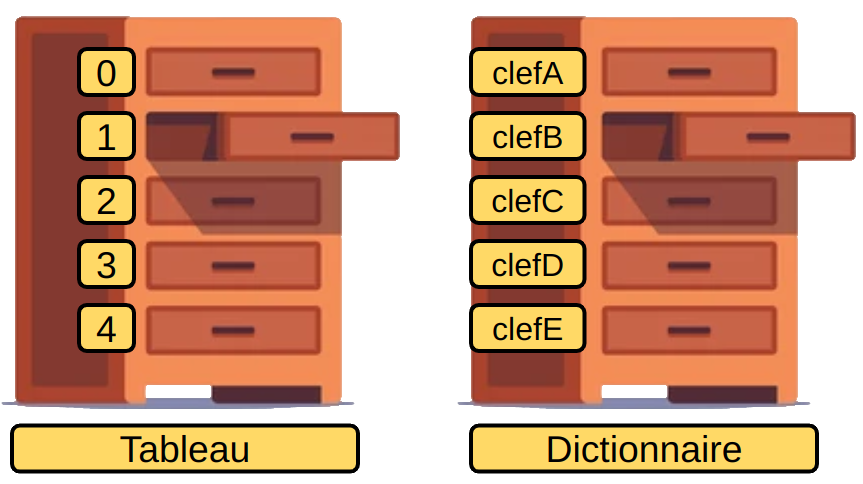

## Comprendre le format JSON

La majorité des API exploite le format **JSON**. Copier/coller les données suivantes et rendez-vous sur: *http://jsonviewer.stack.hu/*. Dans l'onglet *Text* coller vos données et appuyer sur *Format*. Vos données s'affichent désormais de manière indentée. Appuyer sur l'onglet *Viewer*. Ce dernier permet de visualiser la structure hiérarchique de vos données.

```json
[{"name":"Harry Potter","alternate_names":[],"species":"human","gender":"male","house":"Gryffindor","dateOfBirth":"31-07-1980","yearOfBirth":1980,"wizard":true,"ancestry":"half-blood","eyeColour":"green","hairColour":"black","wand":{"wood":"holly","core":"phoenix feather","length":11},"patronus":"stag","hogwartsStudent":true,"hogwartsStaff":false,"actor":"Daniel Radcliffe","alternate_actors":[],"alive":true,"image":"https://hp-api.herokuapp.com/images/harry.jpg"},{"name":"Hermione Granger","alternate_names":[],"species":"human","gender":"female","house":"Gryffindor","dateOfBirth":"19-09-1979","yearOfBirth":1979,"wizard":true,"ancestry":"muggleborn","eyeColour":"brown","hairColour":"brown","wand":{"wood":"vine","core":"dragon heartstring","length":""},"patronus":"otter","hogwartsStudent":true,"hogwartsStaff":false,"actor":"Emma Watson","alternate_actors":[],"alive":true,"image":"https://hp-api.herokuapp.com/images/hermione.jpeg"}]
```

Vous pouvez visualiser deux symboles importants "**[]**" et "**{}**". Les crochets indiquent une liste (un *array*), soit un tableau de valeurs dont les indices sont représentés par des nombres (de 0 à n). Les accolades indiquent un dictionnaire soit une liste de clés/valeurs dans laquelle une valeur est indexée par une clé (chaîne de caractères).

Par exemple, si vous voulez accéder à l'attribut *text* vous pouvez écrire:

```javascript
_json[0]["name"]; // Permet d'accéder à la valeur name du premier élément du tableau.
```

où *_json* est une variable qui stocke le retour de l'API.

## Les fondamentaux de Javascript

Le code Javascript est compris ou importé depuis une balise &lt;<i>script</i>>. L'attribut *src* est utilisé lorsqu'un fichier *.js* doit être importé. Un cours complet sur le Javascript est disponible à cette adresse: https://github.com/PAJEAN/cours_javascript.

### Les variables

```javascript
let my_var = 'Ma variable';
let my_bool = true; // ou false, sensible à la casse.
```

### Les tableaux

```javascript
let my_tab = ['a', 'b'];
console.log(my_tab[0]); // Affiche 'a'.
```

Vérifier si une valeur existe au sein du tableau.

```javascript
my_tab.includes('valeur'); // Renvoie true ou false.
```

Ajouter un élément.

```javascript
my_tab.push('valeur');
```

Supprimer un élément selon un index donné.

```javascript
my_tab.splice(3, 1); // Supprime 1 élément à partir de l'index 3.
```

### Les tableaux associatifs (ou dictionnaire)



Pour accéder aux valeurs d'un tableau, nous utilisons les indexes numériques. Tandis que pour les valeurs des dictionnaires, nous utilisons leurs clés (généralement des chaînes de caractères).

```javascript
let my_dict = {'cle1': 'val1', 'cle2': 'val2'};
console.log(my_dict); // Affiche le dictionnaire dans la console.
console.log(my_dict['cle1']); // Affiche 'val1'.
```

Pour rechercher la présence d'une clé.

```javascript
'cle' in my_dict;
```

Pour ajouter une nouvelle clé/valeur.

```javascript
my_dict['cle3'] = 'val3'; // Ajoute la clé 'cle3' avec la valeur 'val3'.
```

Pour supprimer une clé/valeur.

```javascript
delete my_dict['cle1']; // Supprime la clé 'cle1' et sa valeur 'val1'.
```


### Les boucles

```javascript
for (let i = 0; i < my_tab.length; i++) {
    console.log(my_tab[i]);
}
```

ou

```javascript
for (let key in my_dict) {
    console.log(my_dict[key]);
}
```

ou

```javascript
let i = 0;
while (i < 10) {
    console.log(i);
    i++;
}
```

### Conditions

```javascript
if (a > b) {
    console.log('a est plus grand que b');
} else if (a == b) {
    console.log('a est égal à b');
} else {
    console.log('a est plus petit que b');
}
```

### Fonctions

```javascript
function name() {
    console.log('Une fonction.');
}

name(); // Affiche 'Une fonction' dans la console.
```

### Manipulation du DOM

Sélectionner une ou plusieurs balises HTML en fonction d'un sélecteur CSS.

```javascript
let my_html_tag  = document.querySelector('.my-class'); // Sélectionne la première balise.
let my_html_tags = document.querySelectorAll('.my-class'); // Sélectionne toutes les balises.
```

Ajouter/Supprimer une classe CSS à une balise HTML sélectionnée.

```javascript
my_html_tag.classList.add('my-new-class');
my_html_tag.classList.remove('my-new-class');
```

Ajouter un évènement à une balise HTML.

```javascript
my_html_tag.addEventListener('click', function () {
    console.log('Mon clic !');
});
```

Créer une nouvelle balise HTML.

```javascript
let my_new_html_tag = document.createElement('div');
```

Modifier le contenu d'une balise HTML.

```javascript
my_new_html_tag.innerHTML = 'Le contenu';
```

Ajouter une balise HTML au sein d'une autre balise.

```javascript
my_html_tag.appendChild(my_new_html_tag);
```

### Requêter une API

Pré-requis:

```html
<script src="https://cdn.jsdelivr.net/npm/axios/dist/axios.min.js"></script>
```

Requête GET.

```javascript
axios({
    method: 'get', // ou 'post' par exemple.
    url: 'http://hp-api.herokuapp.com/api/characters',
})
.then((response) => {
    let my_data = response.data;
})
.catch((err) => {
    console.log('An error has occurred.');
})
```
